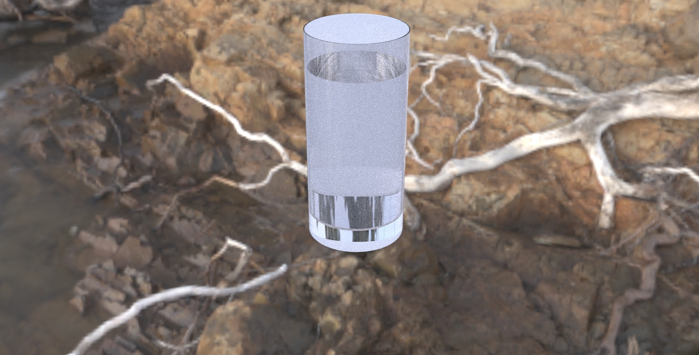

### Questo è il mio primo render in 3D che io abbia mai fatto. E' stato creato in Rhino, seguendo un veloce tutorial, e capendo da solo alcuni passaggi. Visto che non avevo alcuna esperienza pregressa, ci sono evidenti problemi nel render che al momento non riesco a risolvere. Questa è solo una prova, ed in futuro ne farò altre, anche usando Blender, per migliorare i modelli e le texture.

### Questo, invece, è un video che ci è stato assegnato dal maestro di Sound Design per mettere in atto ciò che ci ha insegnato sui BPM delle canzoni, e come accorciarle in modo corretto. Io ho fatto dei video a piazza Garibaldi, e li ho uniti, facendo un taglio a quasi ogni battuta, per racccontare gli eventi di una giornata, in 1 minuto e 30 secondi.

